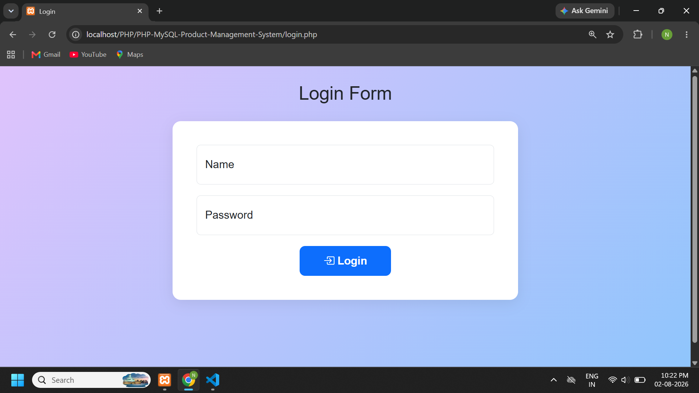
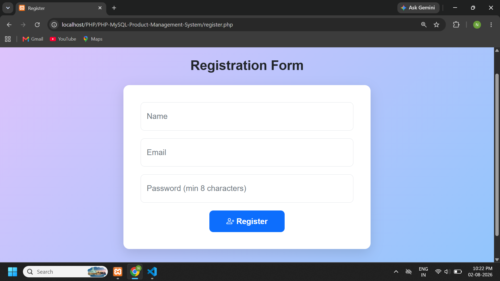
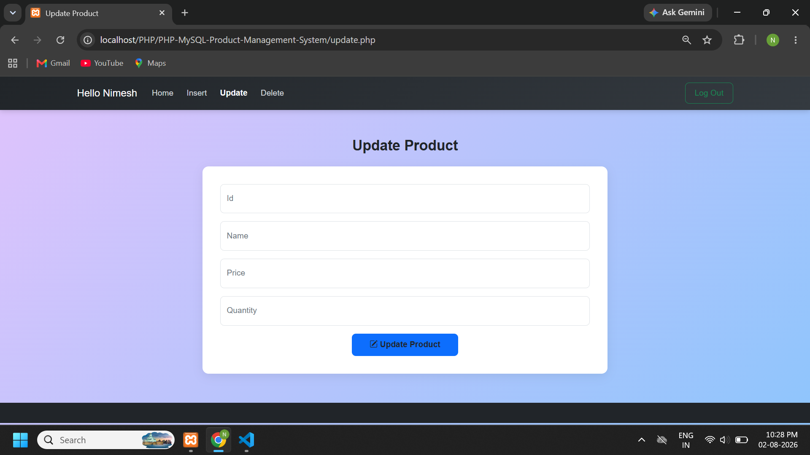
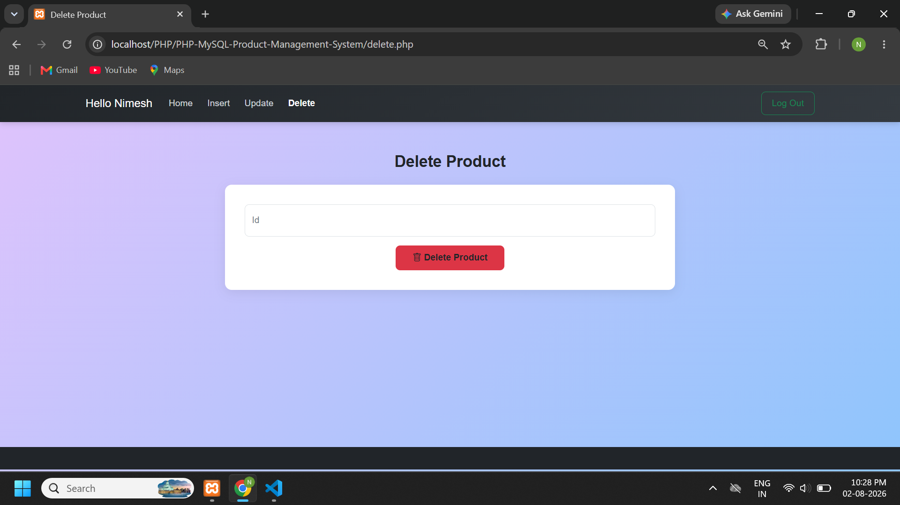

# PHP MySQL Product Management System

A secure and responsive Product Management System built using PHP and MySQL. The application provides user authentication and complete CRUD functionality for managing products.

## 📌 Overview

This project is a web-based product management application developed using PHP and MySQL. It includes a secure authentication system and allows authenticated users to create, view, update, and delete product records.

The project also implements several security practices including password hashing, CSRF protection, XSS protection, prepared statements, session management, and server-side input validation.

---

## ✨ Features

### 🔐 Authentication

- User Registration
- User Login and Logout
- Secure password hashing using `password_hash()`
- Password verification using `password_verify()`
- Session management
- Session ID regeneration after login
- Duplicate username and email prevention

### 📦 Product Management

- Add new products
- View all products
- Update existing products
- Delete products
- Sequential Serial Number display
- Product price and quantity validation

### 🛡️ Security

- Password hashing with PHP's `password_hash()`
- Secure password verification with `password_verify()`
- CSRF protection using secure tokens
- CSRF validation using `hash_equals()`
- SQL Injection prevention using prepared statements
- XSS protection using `htmlspecialchars()`
- Server-side input validation
- Session fixation protection
- Secure database error logging

### 🎨 User Interface

- Responsive design
- Bootstrap 5 styling
- Clean and user-friendly interface
- Mobile-friendly layout

---

## 🛠️ Technologies Used

| Technology | Purpose |
|---|---|
| PHP | Backend development |
| MySQL | Database management |
| HTML5 | Page structure |
| CSS3 | Styling |
| Bootstrap 5 | Responsive UI |
| JavaScript | Client-side functionality |
| XAMPP | Local development environment |

---

## 📸 Screenshots

### 🔐 Login



---

### 📝 Registration



---

### 📊 Product Dashboard


---

### ➕ Add Product


---

### ✏️ Update Product



---

### 🗑️ Delete Product



---

## 📂 Project Structure

```text
PHP-MySQL-Product-Management-System/
│
├── screenshots/
│   ├── login.png
│   ├── register.png
│   ├── dashboard.png
│   ├── add-product.png
│   ├── update-product.png
│   └── delete-product.png
│
├── index.php
├── login.php
├── register.php
├── logout.php
├── home.php
├── insert.php
├── update.php
├── delete.php
├── connect.php
├── schema.sql
├── .htaccess
├── .gitignore
├── .env.example
└── README.md
```

---

## ⚙️ Setup & Installation

Follow the steps below to run the project locally using XAMPP.

### 1. Install XAMPP

Download and install XAMPP on your computer.

Start the following services from the XAMPP Control Panel:

- Apache
- MySQL

### 2. Clone the Repository

Open your terminal and run:

```bash
git clone https://github.com/NimeshNar/PHP-MySQL-Product-Management-System.git
```

---

## 🔐 Security Implementation

This project follows several secure development practices to protect user data and prevent common web application vulnerabilities.

- **Password Hashing:** User passwords are securely hashed using PHP's `password_hash()` function.
- **Password Verification:** Login authentication uses `password_verify()` to securely verify user passwords.
- **SQL Injection Prevention:** Prepared statements are used for database queries.
- **CSRF Protection:** CSRF tokens protect state-changing forms from unauthorized requests.
- **Secure CSRF Validation:** `hash_equals()` is used to securely compare CSRF tokens.
- **XSS Protection:** User-generated content is escaped using `htmlspecialchars()`.
- **Server-Side Validation:** Form inputs are validated on the server before processing.
- **Session Security:** Session IDs are regenerated after successful login to help prevent session fixation attacks.
- **Duplicate Account Prevention:** Duplicate usernames and email addresses are checked during registration.
- **Error Handling:** Database errors are logged securely instead of exposing sensitive information to users.

---

## 📋 Database Tables

### User Table

| Column | Type | Description |
|---|---|---|
| `name` | VARCHAR(100) | Unique username |
| `email` | VARCHAR(150) | Unique email address |
| `password` | VARCHAR(255) | Securely hashed password |

### Product Table

| Column | Type | Description |
|---|---|---|
| `pid` | INT | Auto-increment product ID |
| `pname` | VARCHAR(255) | Product name |
| `pprice` | DECIMAL(10,2) | Product price |
| `pcategory` | VARCHAR(100) | Product category |
| `pquantity` | INT | Product quantity |

---

## 👨‍💻 Author

**Nimesh Nar**

### GitHub

[View My GitHub Profile](https://github.com/NimeshNar)

---

⭐ If you find this project useful, feel free to explore the repository.
